# ☁️ Azure 2-Tier DevOps & Networking Project

> **A hands-on Azure project demonstrating secure cloud networking, Linux administration, reverse proxy configuration, application deployment, database connectivity, and service automation.**


---

## 📌 Project Overview

This project implements a **two-tier application architecture on Microsoft Azure** with a dedicated application tier and database tier.

The objective was to build and validate a realistic cloud environment where:

- The **Application VM** handles web traffic and runs the Flask application.
- The **Database VM** hosts MariaDB inside a separate private subnet.
- **Azure VNet and subnets** provide network segmentation.
- **Network Security Groups (NSGs)** control inbound traffic.
- **Nginx** acts as the public-facing web server and reverse proxy.
- **Flask** provides the application layer.
- **MariaDB** stores application data.
- **systemd** manages the Flask application as a persistent Linux service.
- Private communication between application and database tiers is tested using ICMP and TCP connectivity.

The project focuses primarily on **DevOps, Azure networking, Linux administration, security, and deployment practices**.

---

## 🏗️ Architecture

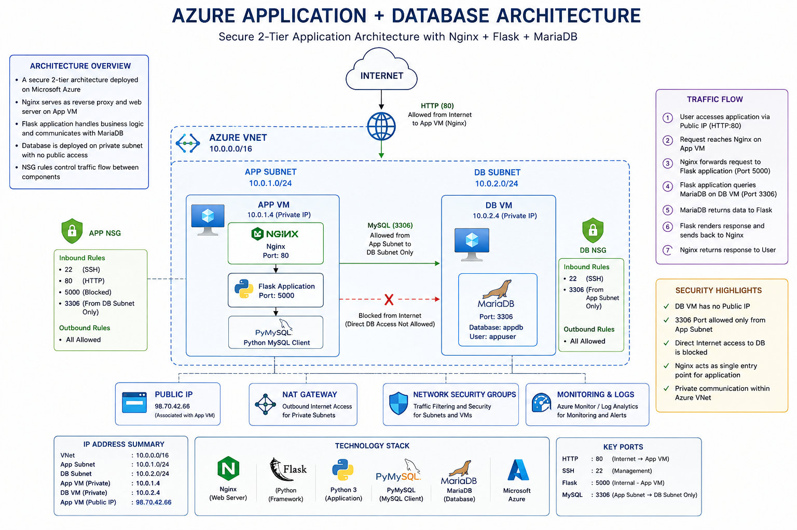

### High-Level Traffic Flow

```text
                         INTERNET
                            │
                            │ HTTP :80
                            ▼
                  ┌──────────────────┐
                  │      App VM      │
                  │    10.0.1.4      │
                  │  Public Subnet   │
                  │                  │
                  │ Nginx :80        │
                  │      │           │
                  │      ▼           │
                  │ Flask :5000      │
                  └────────┬─────────┘
                           │
                           │ TCP :3306
                           │ Private Network
                           ▼
                  ┌──────────────────┐
                  │      DB VM       │
                  │    10.0.2.4      │
                  │  Private Subnet  │
                  │                  │
                  │ MariaDB :3306    │
                  └──────────────────┘
```

### Network Segmentation

| Tier | Subnet | VM | Private IP | Main Role |
|---|---|---|---|---|
| Application | `10.0.1.0/24` | `app-vm` | `10.0.1.4` | Nginx + Flask |
| Database | `10.0.2.0/24` | `db-vm` | `10.0.2.4` | MariaDB |

The database tier is separated from the public application tier using a dedicated subnet and NSG rules.

---

## 🧰 Technology Stack

| Technology | Purpose |
|---|---|
| **Microsoft Azure** | Cloud infrastructure |
| **Azure Virtual Network** | Private network architecture |
| **Azure Subnets** | Application/database segmentation |
| **Network Security Groups** | Traffic filtering and access control |
| **RHEL 9.4** | Linux operating system |
| **Nginx** | Web server / reverse proxy |
| **Python + Flask** | Application backend |
| **MariaDB** | Relational database |
| **systemd** | Application service management |
| **firewalld** | Linux host firewall |
| **SELinux** | Linux security enforcement |
| **Ncat** | TCP connectivity testing |
| **GitHub** | Project documentation and version control |

---

# ☁️ Azure Infrastructure

## 1. Resource Group

The Azure environment is organized inside a dedicated resource group.


---

## 2. Virtual Network & Subnets

The project uses an Azure Virtual Network with separate application and database subnets.

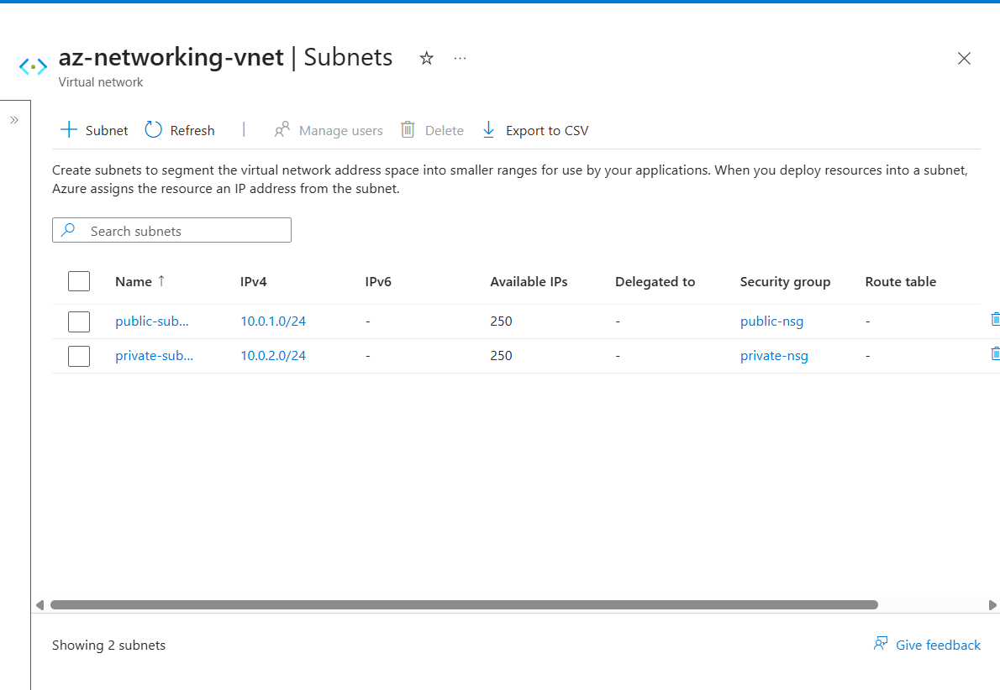

### Design

```text
Azure VNet
│
├── public-subnet
│   └── App VM
│       └── 10.0.1.4
│
└── private-subnet
    └── DB VM
        └── 10.0.2.4
```

This separation limits direct exposure of the database tier and creates a clear two-tier network boundary.

---

# 🖥️ Application Tier

## 3. Application VM

The Application VM is deployed in the application/public subnet.

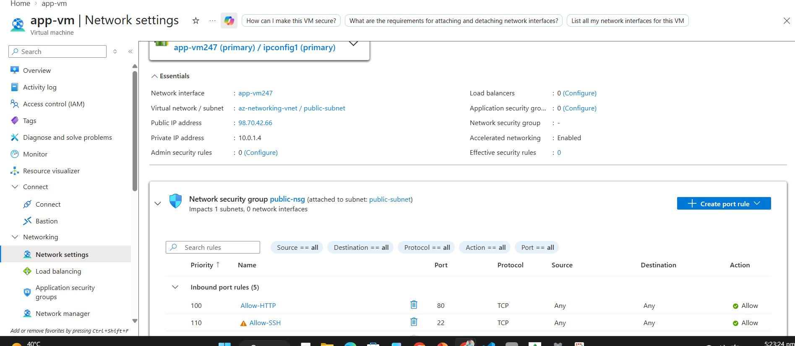

**Role:**

- Receive HTTP traffic
- Run Nginx
- Run Flask application
- Communicate with the database over the private network

---

# 🗄️ Database Tier

## 4. Database VM

The Database VM is deployed in the private subnet.

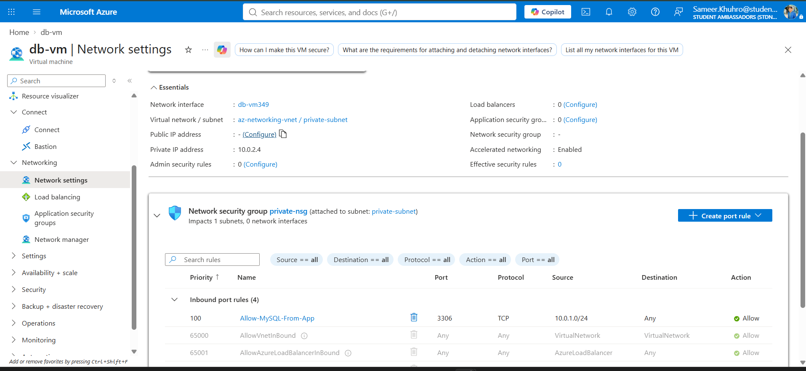

**Private IP:** `10.0.2.4`

**Role:**

- Run MariaDB
- Store application data
- Accept database traffic from the application subnet

The DB VM does not have a directly assigned public IP. Outbound connectivity is provided through the configured NAT Gateway.


---

# 🔐 Network Security

## 5. Public NSG

The public/application side uses an NSG to control permitted inbound traffic.

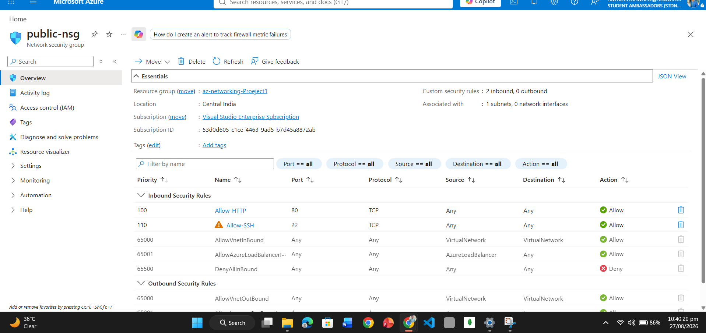

The security design allows required application access while avoiding unnecessary exposure.

---

## 6. Private NSG

The database subnet uses a dedicated NSG.

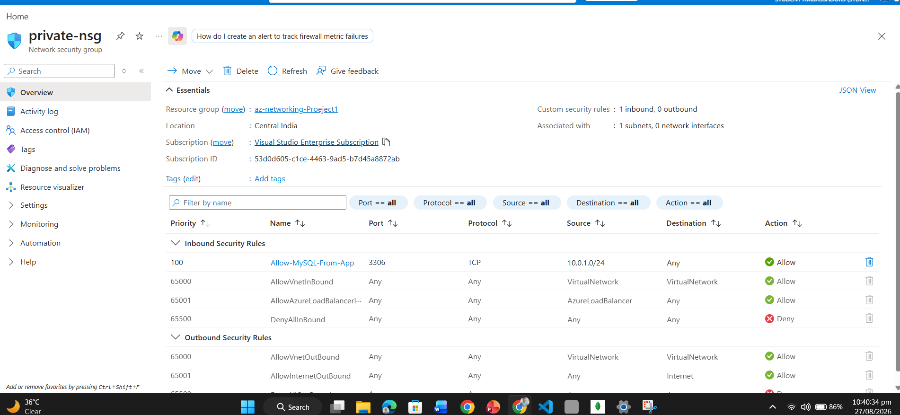

The important database rule is:

```text
Source:      10.0.1.0/24
Protocol:    TCP
Destination: 3306
Purpose:     Application → MariaDB
```


### Security Model

```text
Internet ────────────────X──────────────> DB :3306

App Subnet 10.0.1.0/24 ────────────────> DB :3306 ✓
```

This follows the principle of allowing the database service only from the required application network.

---

# 🐧 Linux Administration

## 7. Application VM Networking

Linux networking was configured and validated on the Application VM.

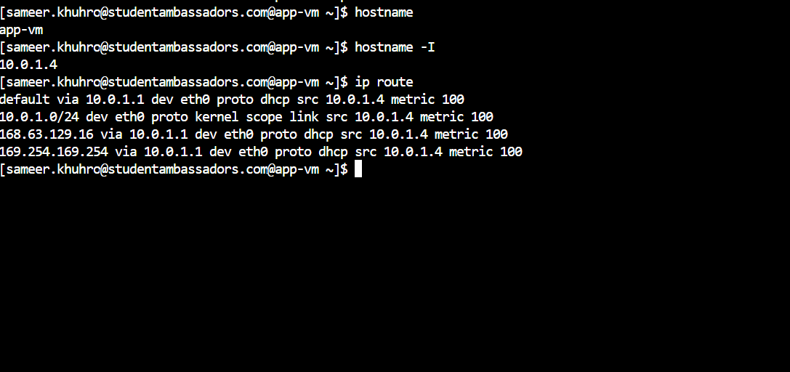

The private network path to the database was verified from the application server.

---

## 8. Database VM Linux Configuration

The database server was configured and verified at the Linux level.

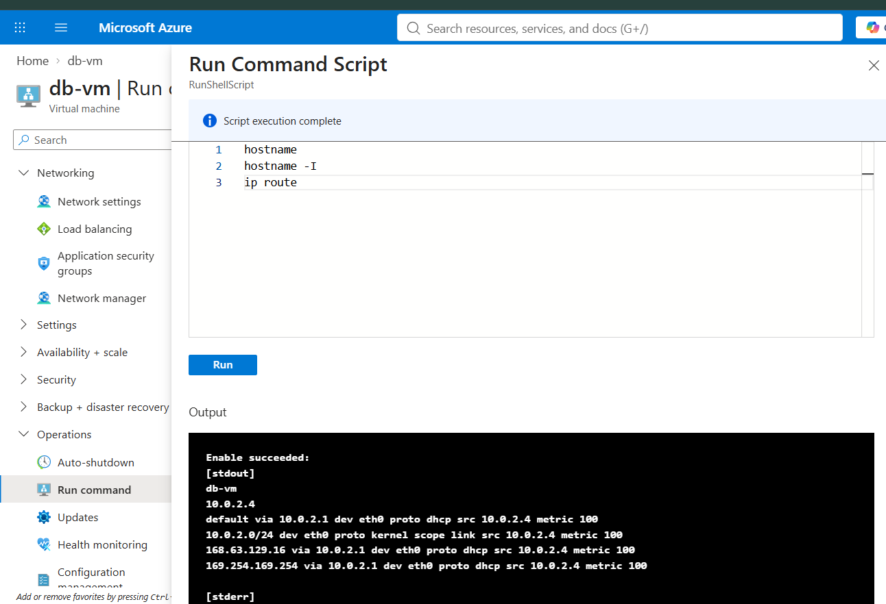

---

# 🗃️ MariaDB Deployment

MariaDB was installed and configured on the Database VM (db-vm) to serve as the persistent data store for the Flask application. This section documents the step-by-step deployment process, verification commands, and the security model that restricts database access to only the application subnet.

## Key Terms

Before proceeding, here are essential Linux and database terms you'll encounter:

| Term | Meaning |
|---|---|
| **Package** | A software bundle (like MariaDB) managed by the Linux package manager. Installing a package adds the software and its configuration files to the system. |
| **Service** | A background process (daemon) that runs automatically on Linux and can be controlled via systemd. Example: `mariadb`. |
| **systemd** | The Linux system and service manager. It controls which services start at boot, can start/stop services, and reports their status. |
| **Enabled** | A service that is configured to start automatically when the system boots. Not the same as "running" — enabled services may not be active yet. |
| **Active (running)** | A service that is currently executing and handling requests. An active service is both enabled and started. |
| **mariadbd** | The MariaDB daemon (background process) — the actual server process that accepts database connections. |
| **Port 3306** | The standard TCP port that MariaDB listens on. TCP allows reliable, connection-based communication over the network. |
| **LISTEN** | The state of a network socket that indicates a service is waiting for incoming connections on that port. |
| **localhost (127.0.0.1)** | A special address meaning "this computer." Traffic to localhost never leaves the machine and cannot be accessed from the network. |
| **Private IP (10.0.x.x)** | An IP address on the internal Azure VNet. It can be reached from other VMs on the same network but not from the public Internet. |

---

## Step 1 — Install MariaDB Server

### Command

```bash
sudo yum install mariadb-server -y
```

### What This Does

This command uses the system package manager (`yum`) to download, install, and configure the MariaDB database server software from the official repository. The `-y` flag automatically answers "yes" to any prompts.

### Why We Use It

MariaDB must be installed before it can run. The package manager handles dependencies automatically — if MariaDB needs other libraries, the package manager installs them too. This is the standard way to install software on RHEL-based systems.

### What You Should Expect

```text
Loaded plugins: product-id, search-disabled-repos, subscription-manager
Dependencies Resolved
...
Installed:
  mariadb-server.x86_64 ...
...
Complete!
```

### How Output Proves It Worked

The package manager reports "Complete!" and lists `mariadb-server` in the "Installed" section. The software is now on disk but **not yet running**.

---

## Step 2 — Verify Package Installation

### Command

```bash
rpm -q mariadb-server
```

### What This Does

This command queries the RPM (Red Hat Package Manager) database to verify that the `mariadb-server` package is installed.

### Why We Use It

After installation, it's good practice to verify the package was actually installed correctly. This confirms the software exists on the system before we try to start it.

### What You Should Expect

```text
mariadb-server-10.5.22-1.el9.x86_64
```

### How Output Proves It Worked

RPM outputs the installed package name and version. If the package were not installed, the command would output `package mariadb-server is not installed` and return a non-zero exit code.

---

## Step 3 — Enable MariaDB Service

### Command

```bash
sudo systemctl enable mariadb
```

### What This Does

This command configures the `mariadb` service to start automatically whenever the DB VM boots up. It creates symbolic links in systemd directories that tell Linux "start MariaDB at boot time."

### Why We Use It

We want MariaDB to be always available, even after an Azure VM reboot. Without enabling the service, MariaDB would be installed but would not start automatically, requiring manual intervention after every reboot. Production systems cannot tolerate this — services must restart automatically.

### What You Should Expect

```text
Created symlink /etc/systemd/system/multi-user.target.wants/mariadb.service → /usr/lib/systemd/system/mariadb.service.
```

(Or similar output indicating the service was enabled.)

### How Output Proves It Worked

systemd reports that symbolic links were created. The service is now "enabled" — it will start automatically at the next boot. Note: "enabled" does **not** mean it's running right now; it means it's configured to run at boot.

---

## Step 4 — Start MariaDB Service

### Command

```bash
sudo systemctl start mariadb
```

### What This Does

This command immediately starts the MariaDB daemon (mariadbd) now, without waiting for the next reboot. The service begins accepting database connections.

### Why We Use It

We need the database to be running immediately so we can test it and the application can connect to it. We do not have to wait for a system reboot.

### What You Should Expect

No output or error — success is silent.

### How Output Proves It Worked

If the service started successfully, the command returns without error. If there was a problem (e.g., port already in use, permission denied), systemd would print an error. Check status (Step 5) to confirm it's actually running.

---

## Step 5 — Check MariaDB Service Status

### Command

```bash
sudo systemctl status mariadb
```

### What This Does

This command queries systemd to report the current state of the `mariadb` service, including whether it is enabled, active, running, and any recent log messages.

### Why We Use It

After starting the service, we must verify it is actually running and not failed. This is critical before testing network connectivity.

### What You Should Expect

```text
● mariadb.service - MariaDB 10.5 database server
   Loaded: loaded (/usr/lib/systemd/system/mariadb.service; enabled)
   Active: active (running) since Fri 2024-XX-XX XX:XX:XX UTC; Xmin ago
 Main PID: XXXX (mariadbd)
   ...
   Status: "Taking your SQL requests now..."
   ...
```

### How Output Proves It Worked

Three key indicators:

1. **Loaded: enabled** — The service is configured to start at boot.
2. **Active: active (running)** — The service is currently running right now.
3. **Main PID: XXXX (mariadbd)** — The MariaDB daemon process (mariadbd) has a Process ID and is active.
4. **Status: "Taking your SQL requests now..."** — MariaDB is ready to accept connections.

If any of these are absent or show "inactive" or "failed," the database is not running and deployment has failed.

---

## Step 6 — Verify MariaDB Listening on TCP Port 3306

### Command

```bash
sudo ss -tlnp | grep mariadb
```

### What This Does

- `ss` = socket statistics (modern replacement for `netstat`)
- `-t` = TCP sockets only
- `-l` = listening sockets (waiting for connections)
- `-n` = show numeric IP addresses and port numbers
- `-p` = show the process name and PID associated with the socket
- `| grep mariadb` = filter output to show only mariadb

This command lists all TCP ports that are listening and filters to show only those owned by MariaDB.

### Why We Use It

Port 3306 is MariaDB's standard port. We must verify that:
1. MariaDB is actually listening (not blocked by the firewall)
2. It is listening on the correct port (3306)
3. It is ready to accept connections from the network

### What You Should Expect

```text
LISTEN  0  80  *:3306  *:*  XXXX/mariadbd
```

or

```text
LISTEN  0  80  0.0.0.0:3306  0.0.0.0:*  XXXX/mariadbd
```

### How Output Proves It Worked

The output shows:
- **LISTEN** = MariaDB is in listening state (ready for connections)
- **3306** = The correct port
- **mariadbd** = The MariaDB daemon is the process owner

The `*:*` or `0.0.0.0:*` means MariaDB is listening on **all network interfaces** (not just localhost). This is necessary because we want the application VM (10.0.1.4) to connect from a different machine.

---

## Step 7 — Configure Linux Firewall (firewalld)

### Command

```bash
sudo firewall-cmd --permanent --add-service=mysql
sudo firewall-cmd --reload
```

### What This Does

- First command: Adds a permanent rule to allow the `mysql` service (MariaDB) through the Linux host firewall.
- `--permanent` = Rule persists after reboot.
- Second command: Reloads firewall rules immediately (applies the change now).

### Why We Use It

Linux on RHEL systems has its own host firewall (`firewalld`) in addition to Azure's NSG. Even if the Azure NSG allows traffic, the Linux firewall could block it. We must allow port 3306 through both layers.

### What You Should Expect

```text
success
success
```

### How Output Proves It Worked

Both commands return "success." This means the firewall rule was added and is now active.

### Verification

```bash
sudo firewall-cmd --list-ports
```

Should include `3306/tcp` in the output.

---

## Step 8 — Understand the Application-to-Database Relationship

### Logical Flow

```text
Flask Application (10.0.1.4:5000)
    │
    │ "SELECT * FROM users"
    │ (TCP connection over private network)
    ▼
MariaDB Server (10.0.2.4:3306)
    │
    │ Returns data
    │
    ▼
Flask Application (displays data)
```

### How It Works

1. **Flask** (running on app-vm at 10.0.1.4) needs to retrieve user data.
2. Flask opens a **TCP connection** to the database VM at `10.0.2.4:3306`.
3. Flask sends SQL commands (e.g., `SELECT * FROM users;`).
4. **MariaDB** receives the query, executes it, and returns the results.
5. Flask formats the data and displays it to the user in the web browser.

### Critical Point: Private Network Only

- The application and database communicate entirely over the Azure private network (10.0.x.x).
- This communication **never reaches the public Internet**.
- Traffic from the App VM to the DB VM is not exposed to outside attackers.

---

## Step 9 — Azure NSG Rule for Port 3306

### The Security Rule

On the **Private NSG** (applied to the database subnet):

| Property | Value | Purpose |
|---|---|---|
| **Source** | `10.0.1.0/24` (App Subnet) | Only traffic from the application subnet |
| **Source Port** | Any | Applications use dynamic ports |
| **Destination** | `*` (Any) | Database VM is the only resource here anyway |
| **Destination Port** | `3306` | MariaDB port only |
| **Protocol** | `TCP` | Reliable, connection-oriented communication |
| **Action** | `Allow` | Permit this traffic |
| **Priority** | (Lower than deny-all) | Processed before default deny |

### What This Means

```text
Internet (e.g., 203.0.113.1) ──X──> MariaDB :3306
                    ↑
                 BLOCKED by NSG

App VM (10.0.1.4) ──✓──> MariaDB :3306
                    ↑
                 ALLOWED by NSG
```

- Any external attacker trying to reach port 3306 is blocked at the Azure network layer.
- Only the application subnet can reach port 3306.
- This is **defense in depth** — even if someone somehow broke into the Internet-facing App VM, they still couldn't directly reach the database if they couldn't exploit the application.

### How to Verify the Rule

See screenshot:


---

## Step 10 — Test Connectivity: App VM → DB VM

### ICMP Ping Test (Verify Routing)

```bash
ping -c 4 10.0.2.4
```

**What This Does:**
- Sends 4 ICMP echo requests to the DB VM.
- ICMP is not TCP — it's a different protocol used for network diagnostics.

**Expected Output:**
```text
PING 10.0.2.4 (10.0.2.4) 56(84) bytes of data.
64 bytes from 10.0.2.4: icmp_seq=1 ttl=64 time=2.34 ms
64 bytes from 10.0.2.4: icmp_seq=2 ttl=64 time=2.45 ms
64 bytes from 10.0.2.4: icmp_seq=3 ttl=64 time=2.52 ms
64 bytes from 10.0.2.4: icmp_seq=4 ttl=64 time=2.38 ms

--- 10.0.2.4 statistics ---
4 packets transmitted, 4 received, 0% packet loss, time 3005ms
rtt min/avg/max/mdev = 2.34/2.42/2.52/0.07 ms
```

**How It Proves Routing Works:**
- All 4 packets received → Network path exists.
- 0% packet loss → No packets dropped in transit.
- Response time ~2-3 ms → Both machines are close (same VNet).

### TCP Port Test (Verify MariaDB is Listening)

```bash
nc -zv 10.0.2.4 3306
```

**What This Does:**
- `nc` (ncat/netcat) = network utility
- `-z` = zero-I/O mode (just test if port is open, don't send data)
- `-v` = verbose (show detailed output)
- `10.0.2.4 3306` = database VM and port

**Expected Output:**
```text
Connection to 10.0.2.4 3306 port [tcp/mysql] succeeded!
```

**How It Proves MariaDB is Reachable:**
- Connection succeeded → TCP 3306 is open and listening.
- The Azure NSG allows app-subnet → db-subnet on port 3306.
- The Linux firewall allows port 3306.
- MariaDB daemon is running and accepts connections.

### Failed Connectivity Diagnostics

If either test fails, check:

| Symptom | Likely Cause | Check |
|---|---|---|
| Ping fails (0% packet loss) | NSG blocks ICMP, or VMs not on same VNet | Azure NSG rules; VNet/subnet config |
| Ping succeeds but `nc` fails | Port 3306 is blocked | Linux firewall on DB VM; NSG destination port rule |
| `nc` timeout (no response) | MariaDB not running | `sudo systemctl status mariadb` on DB VM |
| `nc` "Connection refused" | MariaDB crashed or not listening on 3306 | Check MariaDB logs; restart service |

---

## Step 11 — Verify Application Data Retrieval from MariaDB

### Test Application Connection to Database

From the **Application VM**, verify that the Flask application can retrieve data:

```bash
mysql -h 10.0.2.4 -u appuser -p -e "SELECT * FROM appdb.users LIMIT 5;"
```

**What This Does:**
- `mysql` = MySQL/MariaDB command-line client
- `-h 10.0.2.4` = Connect to the database VM (database host)
- `-u appuser` = Use the application user account
- `-p` = Prompt for password (for security, password is not shown)
- `-e "SELECT ..."` = Execute the SQL query
- `appdb.users` = Database name and table name

**Expected Output:**
```text
+----+---------+--------------------+
| id | name    | email              |
+----+---------+--------------------+
|  1 | Sameer  | sameer@example.com |
|  2 | Ali     | ali@example.com    |
+----+---------+--------------------+
```

**How It Proves End-to-End Success:**
- Connection succeeded → TCP 3306 is working.
- Query executed → MariaDB accepted the SQL.
- Data returned → Application data is present and retrievable.
- This proves the Flask application can fetch data from MariaDB over the private network.

### View Application Output

Access the Flask application through the browser:

```text
http://<app-vm-public-ip>/
```

The web page displays the data retrieved from MariaDB, proving the complete flow works:

```text
Browser → Nginx → Flask → MariaDB → Flask → Browser
```

---

## MariaDB Deployment Verification

The screenshot below shows the complete MariaDB state on the Database VM:

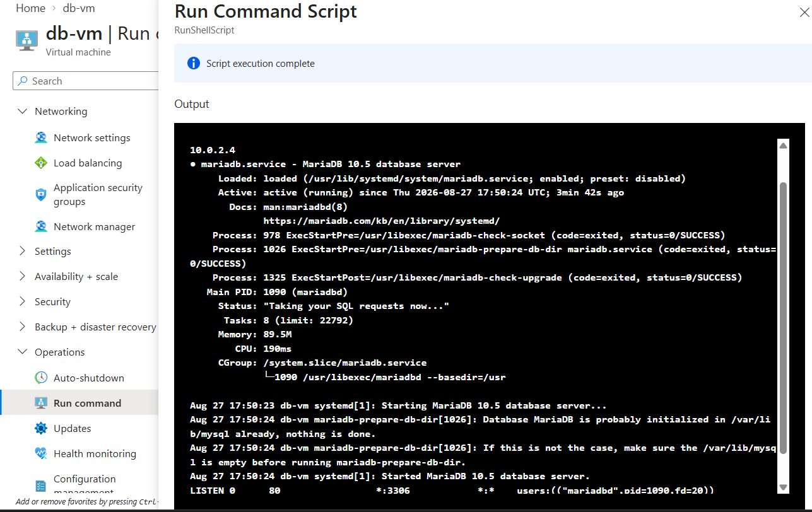

This screenshot confirms:

- ✅ MariaDB 10.5 is installed
- ✅ Service is enabled (will start on boot)
- ✅ Service is active (running now)
- ✅ Main PID is assigned (mariadbd process)
- ✅ Status shows "Taking your SQL requests now..."
- ✅ MariaDB is listening on port 3306 (\*:3306 means all interfaces)
- ✅ Private IP is 10.0.2.4 (correct subnet)

Additional verification:

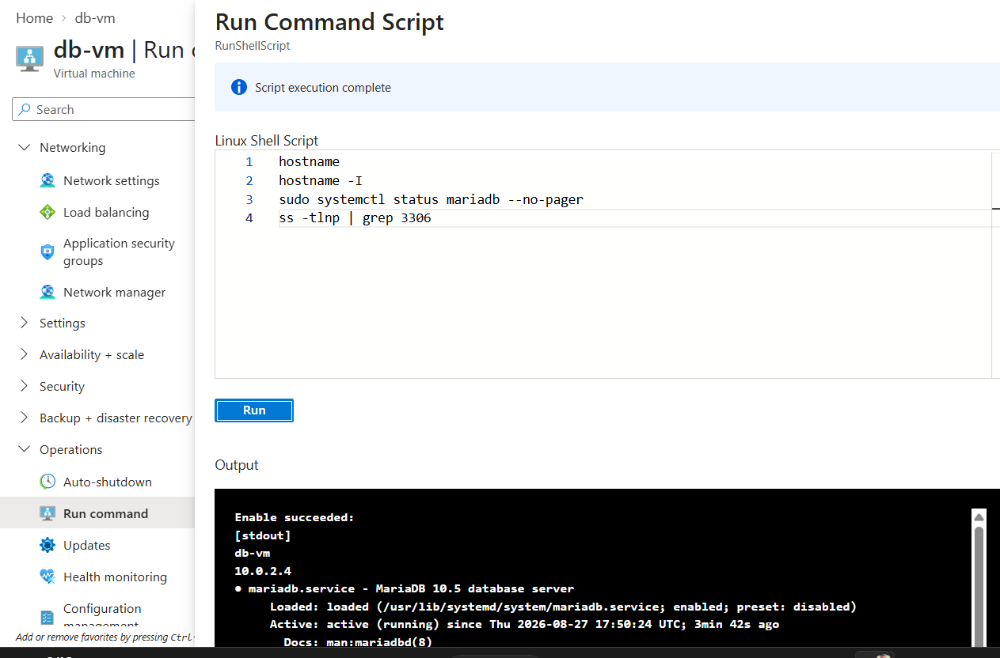

---

# 🌐 Application Deployment

## 9. Flask Application

The application runs on the Application VM using Flask.

Flask listens locally on:

```text
127.0.0.1:5000
```

This means the Flask development server is **not directly exposed to the Internet**.

Nginx receives public HTTP requests and forwards them internally to Flask.

---

# 🔄 Nginx Reverse Proxy

The application traffic follows:

```text
Browser
   │
   │ HTTP :80
   ▼
Nginx
   │
   │ proxy_pass
   ▼
Flask :5000
   │
   │ TCP :3306
   ▼
MariaDB
```

Nginx therefore acts as the public-facing web layer while Flask remains bound to localhost.

---

# ⚙️ systemd Service Management

Instead of manually running the Flask application with:

```bash
python3 app.py
```

the application was configured as a Linux `systemd` service.

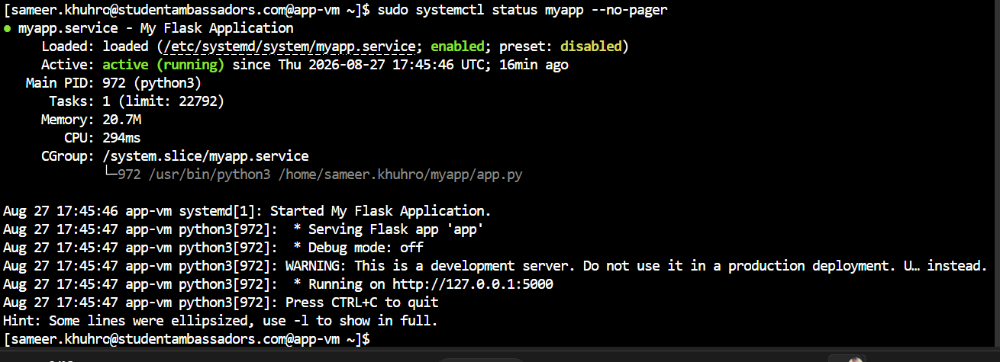

The service is configured to start automatically with the VM.

### Validation

```text
myapp.service
Active: active (running)
```

The VM was rebooted and the service was verified again, demonstrating service persistence across system restarts.

---

# 🔗 Application-to-Database Connectivity

Connectivity between the two tiers was tested from the Application VM.

### ICMP Test

```bash
ping -c 4 10.0.2.4
```

The DB VM responded successfully.

### TCP Port Test

```bash
nc -zv 10.0.2.4 3306
```

Expected successful result:

```text
Connected to 10.0.2.4:3306
```

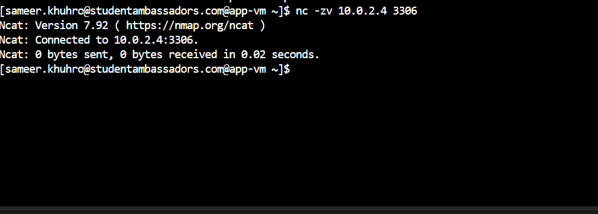

This validates that the application tier can reach MariaDB through the intended private network path.

---

# 🛡️ Security Validation

The project validates security at multiple layers:

### Azure Layer

- Separate application and database subnets
- NSGs applied to control network traffic
- MariaDB `3306` restricted to the application subnet
- Database VM has no directly assigned public IP

### Linux Layer

- `firewalld` configured for required services
- SELinux kept in enforcing mode
- SELinux policy adjusted to permit the Nginx reverse-proxy connection to Flask

### Application Layer

- Flask listens on `127.0.0.1:5000`
- Nginx is the public HTTP entry point
- Database communication occurs over the private network

---

# 🖥️ Final Application

The final web application displays data retrieved from the private MariaDB server.


Example data:

| ID | Name | Email |
|---:|---|---|
| 1 | Sameer | sameer@example.com |
| 2 | Ali | ali@example.com |

This demonstrates the complete path:

```text
User
 ↓
Public IP
 ↓
Nginx
 ↓
Flask
 ↓
Private Network
 ↓
MariaDB
 ↓
Application Response
```

---

# 🔍 Project Validation Checklist

| Component | Validation |
|---|---|
| Azure Resource Group | ✅ |
| VNet | ✅ |
| Application subnet | ✅ |
| Private database subnet | ✅ |
| Application VM | ✅ |
| Database VM | ✅ |
| Public NSG | ✅ |
| Private NSG | ✅ |
| MariaDB | ✅ |
| Port `3306` restriction | ✅ |
| App → DB private connectivity | ✅ |
| Nginx | ✅ |
| Flask | ✅ |
| systemd service | ✅ |
| Reboot persistence | ✅ |
| Final web application | ✅ |

---

# 🚀 DevOps Skills Demonstrated

This project demonstrates practical experience with:

- ☁️ Azure VM provisioning
- 🌐 Azure VNet and subnet design
- 🔐 NSG-based network security
- 🐧 RHEL/Linux administration
- 🔥 firewalld configuration
- 🛡️ SELinux troubleshooting
- 🌐 Nginx configuration
- 🔄 Reverse proxy architecture
- 🐍 Flask application deployment
- 🗄️ MariaDB administration
- 🔗 Private application/database networking
- ⚙️ systemd service management
- 🧪 Network connectivity testing
- 🔁 Service persistence after reboot
- 📖 Technical documentation

---

# 🎯 Project Outcome

The final environment demonstrates a functional **Azure two-tier application architecture** where a publicly accessible application tier communicates with a protected database tier through private networking.

The project combines **cloud infrastructure, networking, Linux administration, security, application deployment, and service automation** into one practical DevOps workflow.

> **Built to learn by doing — from Azure networking to a working application.**

---

## 📂 Repository Structure

```text
azure-2-tier-app/
│
├── README.md
│
├── architecture/
│   └── 12.Architecture.png
│
└── screenshots/
    ├── 01.resource-group.png
    ├── 2.vnet-subnets.png
    ├── 3.app-vm-networking.png
    ├── 4.db-vm-networking.png
    ├── 5.public-nsg.png
    ├── 6.private-nsg.png
    ├── 7.app-vm-linux-networking.png
    ├── 8.1.db-vm-networking-linux.png
    ├── 8.2-db-vm-mariadb.png
    ├── 8.3-db-vm.png
    ├── 9.app-to-db-conectivity.png
    ├── 10.flask-systemd.png.png
    ├── 11.final-application.png
    ├── 13.db-vm-no-public-ip.png
    └── 14.db-nsg-3306-restricted.png
```

---

## 👨‍💻 Author

**Sameer Khuhro**

*Software Engineering Student | Aspiring DevOps / Cloud Engineer*

**Focus:** Azure • Linux • Networking • DevOps
