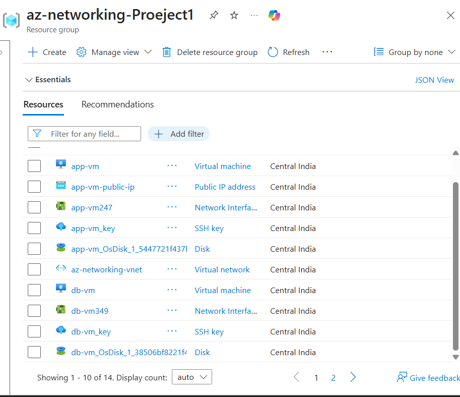
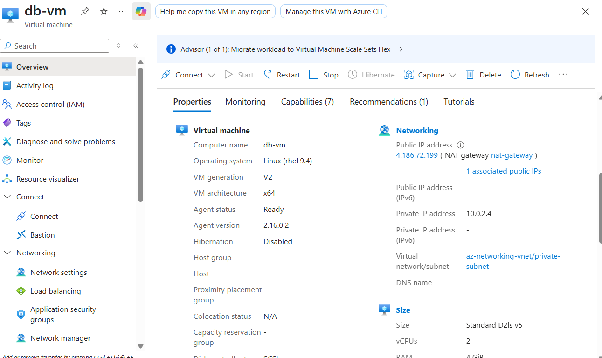
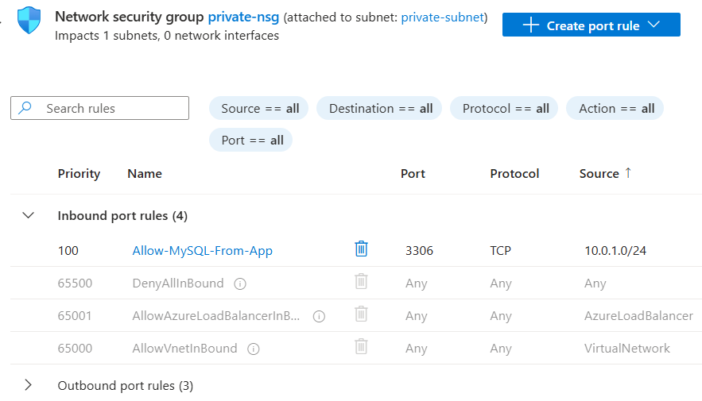
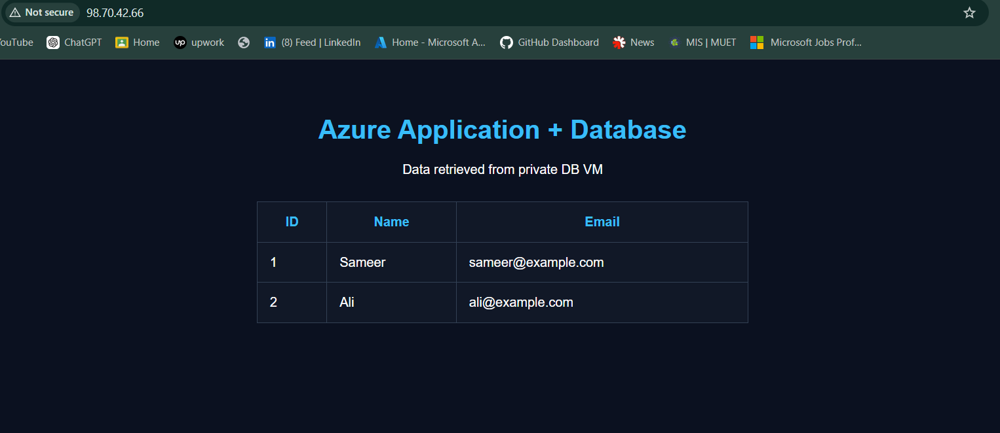

# ☁️ Azure 2-Tier DevOps & Networking Project

> **A hands-on Azure project demonstrating secure cloud networking, Linux administration, reverse proxy configuration, application deployment, database connectivity, and service automation.**


---

## 📌 Project Overview

This project implements a **two-tier application architecture on Microsoft Azure** with a dedicated application tier and database tier.

The objective was to build and validate a realistic cloud environment where:

- The **Application VM** handles web traffic and runs the Flask application.
- The **Database VM** hosts MariaDB inside a separate private subnet.
- **Azure VNet and subnets** provide network segmentation.
- **Network Security Groups (NSGs)** control inbound traffic.
- **Nginx** acts as the public-facing web server and reverse proxy.
- **Flask** provides the application layer.
- **MariaDB** stores application data.
- **systemd** manages the Flask application as a persistent Linux service.
- Private communication between application and database tiers is tested using ICMP and TCP connectivity.

The project focuses primarily on **DevOps, Azure networking, Linux administration, security, and deployment practices**.

---

## 🏗️ Architecture


### High-Level Traffic Flow

```text
                         INTERNET
                            │
                            │ HTTP :80
                            ▼
                  ┌──────────────────┐
                  │      App VM      │
                  │    10.0.1.4      │
                  │  Public Subnet   │
                  │                  │
                  │ Nginx :80        │
                  │      │           │
                  │      ▼           │
                  │ Flask :5000      │
                  └────────┬─────────┘
                           │
                           │ TCP :3306
                           │ Private Network
                           ▼
                  ┌──────────────────┐
                  │      DB VM       │
                  │    10.0.2.4      │
                  │  Private Subnet  │
                  │                  │
                  │ MariaDB :3306    │
                  └──────────────────┘
```

### Network Segmentation

| Tier | Subnet | VM | Private IP | Main Role |
|---|---|---|---|---|
| Application | `10.0.1.0/24` | `app-vm` | `10.0.1.4` | Nginx + Flask |
| Database | `10.0.2.0/24` | `db-vm` | `10.0.2.4` | MariaDB |

The database tier is separated from the public application tier using a dedicated subnet and NSG rules.

---

## 🧰 Technology Stack

| Technology | Purpose |
|---|---|
| **Microsoft Azure** | Cloud infrastructure |
| **Azure Virtual Network** | Private network architecture |
| **Azure Subnets** | Application/database segmentation |
| **Network Security Groups** | Traffic filtering and access control |
| **RHEL 9.4** | Linux operating system |
| **Nginx** | Web server / reverse proxy |
| **Python + Flask** | Application backend |
| **MariaDB** | Relational database |
| **systemd** | Application service management |
| **firewalld** | Linux host firewall |
| **SELinux** | Linux security enforcement |
| **Ncat** | TCP connectivity testing |
| **GitHub** | Project documentation and version control |

---

# ☁️ Azure Infrastructure

## 1. Resource Group

The Azure environment is organized inside a dedicated resource group.



---

## 2. Virtual Network & Subnets

The project uses an Azure Virtual Network with separate application and database subnets.


### Design

```text
Azure VNet
│
├── public-subnet
│   └── App VM
│       └── 10.0.1.4
│
└── private-subnet
    └── DB VM
        └── 10.0.2.4
```

This separation limits direct exposure of the database tier and creates a clear two-tier network boundary.

---

# 🖥️ Application Tier

## 3. Application VM

The Application VM is deployed in the application/public subnet.


**Role:**

- Receive HTTP traffic
- Run Nginx
- Run Flask application
- Communicate with the database over the private network

---

# 🗄️ Database Tier

## 4. Database VM

The Database VM is deployed in the private subnet.


**Private IP:** `10.0.2.4`

**Role:**

- Run MariaDB
- Store application data
- Accept database traffic from the application subnet

The DB VM does not have a directly assigned public IP. Outbound connectivity is provided through the configured NAT Gateway.



---

# 🔐 Network Security

## 5. Public NSG

The public/application side uses an NSG to control permitted inbound traffic.


The security design allows required application access while avoiding unnecessary exposure.

---

## 6. Private NSG

The database subnet uses a dedicated NSG.


The important database rule is:

```text
Source:      10.0.1.0/24
Protocol:    TCP
Destination: 3306
Purpose:     Application → MariaDB
```



### Security Model

```text
Internet ────────────────X──────────────> DB :3306

App Subnet 10.0.1.0/24 ────────────────> DB :3306 ✓
```

This follows the principle of allowing the database service only from the required application network.

---

# 🐧 Linux Administration

## 7. Application VM Networking

Linux networking was configured and validated on the Application VM.


The private network path to the database was verified from the application server.

---

## 8. Database VM Linux Configuration

The database server was configured and verified at the Linux level.


---

# 🗃️ MariaDB Deployment

MariaDB was installed and configured on the DB VM.


The database service was verified as running and listening on TCP port `3306`.


### Database

```text
Database: appdb
Port:     3306
Server:   10.0.2.4
```

The application retrieves records from the database, demonstrating end-to-end application/database communication.

---

# 🌐 Application Deployment

## 9. Flask Application

The application runs on the Application VM using Flask.

Flask listens locally on:

```text
127.0.0.1:5000
```

This means the Flask development server is **not directly exposed to the Internet**.

Nginx receives public HTTP requests and forwards them internally to Flask.

---

# 🔄 Nginx Reverse Proxy

The application traffic follows:

```text
Browser
   │
   │ HTTP :80
   ▼
Nginx
   │
   │ proxy_pass
   ▼
Flask :5000
   │
   │ TCP :3306
   ▼
MariaDB
```

Nginx therefore acts as the public-facing web layer while Flask remains bound to localhost.

---

# ⚙️ systemd Service Management

Instead of manually running the Flask application with:

```bash
python3 app.py
```

the application was configured as a Linux `systemd` service.


The service is configured to start automatically with the VM.

### Validation

```text
myapp.service
Active: active (running)
```

The VM was rebooted and the service was verified again, demonstrating service persistence across system restarts.

---

# 🔗 Application-to-Database Connectivity

Connectivity between the two tiers was tested from the Application VM.

### ICMP Test

```bash
ping -c 4 10.0.2.4
```

The DB VM responded successfully.

### TCP Port Test

```bash
nc -zv 10.0.2.4 3306
```

Expected successful result:

```text
Connected to 10.0.2.4:3306
```


This validates that the application tier can reach MariaDB through the intended private network path.

---

# 🛡️ Security Validation

The project validates security at multiple layers:

### Azure Layer

- Separate application and database subnets
- NSGs applied to control network traffic
- MariaDB `3306` restricted to the application subnet
- Database VM has no directly assigned public IP

### Linux Layer

- `firewalld` configured for required services
- SELinux kept in enforcing mode
- SELinux policy adjusted to permit the Nginx reverse-proxy connection to Flask

### Application Layer

- Flask listens on `127.0.0.1:5000`
- Nginx is the public HTTP entry point
- Database communication occurs over the private network

---

# 🖥️ Final Application

The final web application displays data retrieved from the private MariaDB server.



Example data:

| ID | Name | Email |
|---:|---|---|
| 1 | Sameer | sameer@example.com |
| 2 | Ali | ali@example.com |

This demonstrates the complete path:

```text
User
 ↓
Public IP
 ↓
Nginx
 ↓
Flask
 ↓
Private Network
 ↓
MariaDB
 ↓
Application Response
```

---

# 🔍 Project Validation Checklist

| Component | Validation |
|---|---|
| Azure Resource Group | ✅ |
| VNet | ✅ |
| Application subnet | ✅ |
| Private database subnet | ✅ |
| Application VM | ✅ |
| Database VM | ✅ |
| Public NSG | ✅ |
| Private NSG | ✅ |
| MariaDB | ✅ |
| Port `3306` restriction | ✅ |
| App → DB private connectivity | ✅ |
| Nginx | ✅ |
| Flask | ✅ |
| systemd service | ✅ |
| Reboot persistence | ✅ |
| Final web application | ✅ |

---

# 🚀 DevOps Skills Demonstrated

This project demonstrates practical experience with:

- ☁️ Azure VM provisioning
- 🌐 Azure VNet and subnet design
- 🔐 NSG-based network security
- 🐧 RHEL/Linux administration
- 🔥 firewalld configuration
- 🛡️ SELinux troubleshooting
- 🌐 Nginx configuration
- 🔄 Reverse proxy architecture
- 🐍 Flask application deployment
- 🗄️ MariaDB administration
- 🔗 Private application/database networking
- ⚙️ systemd service management
- 🧪 Network connectivity testing
- 🔁 Service persistence after reboot
- 📖 Technical documentation

---

# 🎯 Project Outcome

The final environment demonstrates a functional **Azure two-tier application architecture** where a publicly accessible application tier communicates with a protected database tier through private networking.

The project combines **cloud infrastructure, networking, Linux administration, security, application deployment, and service automation** into one practical DevOps workflow.

> **Built to learn by doing — from Azure networking to a working application.**

---

## 📂 Repository Structure

```text
azure-2-tier-app/
│
├── README.md
│
├── architecture/
│   └── 12.architecture.png
│
└── screenshots/
    ├── 01.resource-group.png
    ├── 02.vnet-subnets.png
    ├── 03.app-vm-networking.png
    ├── 04.db-vm-networking.png
    ├── 05.public-nsg.png
    ├── 06.private-nsg.png
    ├── 07.app-vm-linux-networking.png
    ├── 08.1.db-vm-networking-linux.png
    ├── 08.2-db-vm-mariadb.png
    ├── 08.3-db-vm.png
    ├── 09.app-to-db-connectivity.png
    ├── 10.flask-systemd.png
    ├── 11.final-application.png
    ├── 13.db-vm-no-public-ip.png
    └── 14.db-nsg-3306-restricted.png
```

---

## 👨‍💻 Author

**Sameer Khuhro**

*Software Engineering Student | Aspiring DevOps / Cloud Engineer*

**Focus:** Azure • Linux • Networking • DevOps
